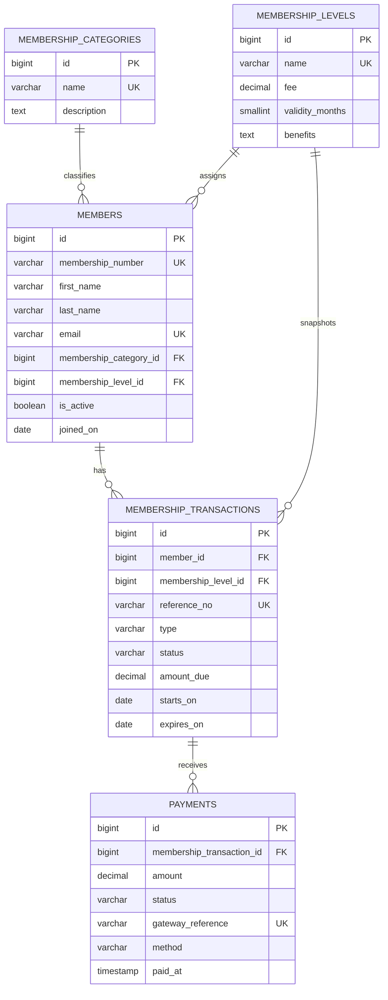

# Phase 1 Entity Relationship Diagram

```mermaid
erDiagram
    MEMBERSHIP_CATEGORIES ||--o{ MEMBERS : classifies
    MEMBERSHIP_LEVELS ||--o{ MEMBERS : assigns
    MEMBERS ||--o{ MEMBERSHIP_TRANSACTIONS : has
    MEMBERSHIP_LEVELS ||--o{ MEMBERSHIP_TRANSACTIONS : snapshots
    MEMBERSHIP_TRANSACTIONS ||--o{ PAYMENTS : receives

    MEMBERSHIP_CATEGORIES {
        bigint id PK
        varchar name UK
        text description
    }
    MEMBERSHIP_LEVELS {
        bigint id PK
        varchar name UK
        decimal fee
        smallint validity_months
        text benefits
    }
    MEMBERS {
        bigint id PK
        varchar membership_number UK
        varchar first_name
        varchar last_name
        varchar email UK
        bigint membership_category_id FK
        bigint membership_level_id FK
        boolean is_active
        date joined_on
    }
    MEMBERSHIP_TRANSACTIONS {
        bigint id PK
        bigint member_id FK
        bigint membership_level_id FK
        varchar reference_no UK
        varchar type
        varchar status
        decimal amount_due
        date starts_on
        date expires_on
    }
    PAYMENTS {
        bigint id PK
        bigint membership_transaction_id FK
        decimal amount
        varchar status
        varchar gateway_reference UK
        varchar method
        timestamp paid_at
    }
```

`membership_transactions.amount_due` is intentionally a snapshot of the level fee at transaction creation time.
